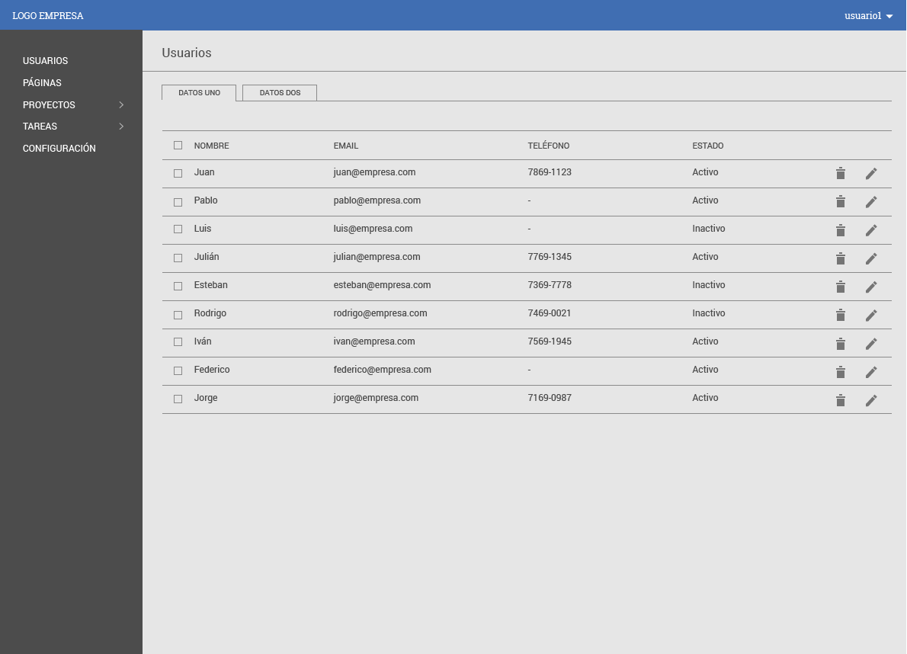

# Desarrollo software administración de usuarios


## Se requiere realizar un software con las siguientes características.


Realizar una aplicación con la capacidad de insertar, modificar, eliminar,
y consultar (CRUD) registros sobre una tabla de usuarios con los campos (id, nombre, apellido,
password, email, estado, teléfono) sobre una base de datos local que puede ser en archivos de tipo (.txt,
.json u otro) preferiblemente, todo esto en nodejs, dichos archivos deben de 
estar excluidos del repositorio, posteriormente realizar el admin o front de la apicación en reactJs.  


## Tener en cuenta

- Hostear la applicación en un repositorio publico de github
sobre la rama master y enviar la url al correo **yefriddavid@gmail.com**

- Las variables de configuración de la solución frontend y backend
deben estar definidas dentro de un archivo .env.example, para cada proyecto si
dichas variables son necesarias y excluir el .env del repositorio global.


- El despliegue de las applicaciones debe estar documentado dentro del archivo README.md donde sea clara la descripción de como se despliega el
software.  

- La solucion debe contener estandares, patrones y metodologías conocidas y claras
de desarrollo las cuales deben estar sustentadas dentro del codigo.

- El software debe estar escrito en ingles a nivel de codigo y presentación.

- El repositorio debe contener dos folders con los nombres **api** y **webapp**
  respectivamente.


### Folder project tree example
```
./projects/usermanager/
.
├── api
│   ├── app.js
│   └── package.json
└── webapp
    └── package.json
```

### Librerias requeridas a usar
```
reactJs
```


### Libraries deseables
```
sagas
redux
redux-sagas
redux-act
axios
react-router-dom
socket.io-client

```


### Metodologías y patrones deseables
```
BEM (Css)
Ecmascript 5
Ecmascript 6
Ecmascript 7


```


### La presentación del software debe ser algo aproximado al siguiente ejemplo.





| Tecnologías   | Requerida     | Opcional  	|
| ------------- |:-------------:|:-------------:|
| ReactJs       | 	x 	|  		|
| Sagas         |  		| 	x 	|
| Redux         |  		| 	x 	|
| Axios         |  		| 	x 	|
| Redux-sagas   |  		| 	x 	|
